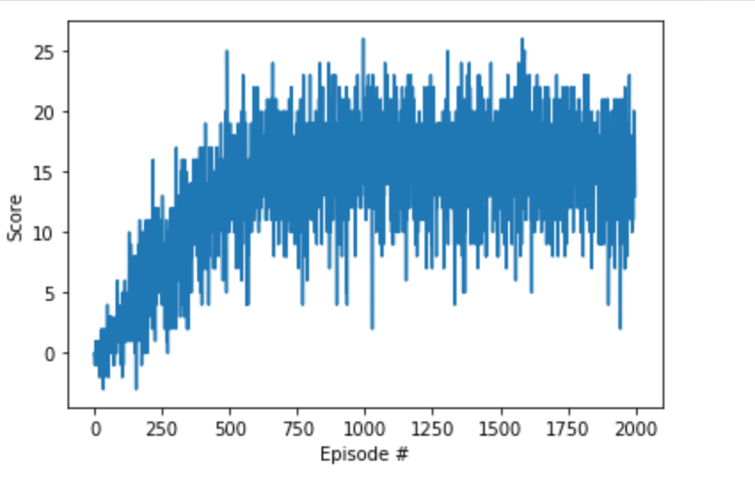

## Project 1 - Navigation - Traning DeepRL agent to collect yellow bananas.
Solution - Average score of 13+ rewards across 100 consecutive episodes achieved with 403 episodes.
Environment Used - Banana.app from Unity.
Envrironment has 37 states with 4 discrete actions.

### Learning Algorithm Used - DQN - 
1) Vanilla Deep Q-Learning Network from DQN session used. 
2) Network Architecture And Hyperparamenters - 
    Number of hidden layers - 2 each with 64 neurons,  
    Activation function used RELU,  
    BATCH_SIZE = 64         # minibatch size  
    GAMMA = 0.99            # discount factor  
    TAU = 1e-3              # for soft update of target parameters .  
    LR = 5e-4               # learning rate  

### Plot of Rewards - 

### Improvements - 
With more hyperparameters tuning and some network architecture changes, number of episodes required can be reduced. 
Currently plain DQN has been used, other option to try out is Rainbow and Double DQN, to see the improvements.

