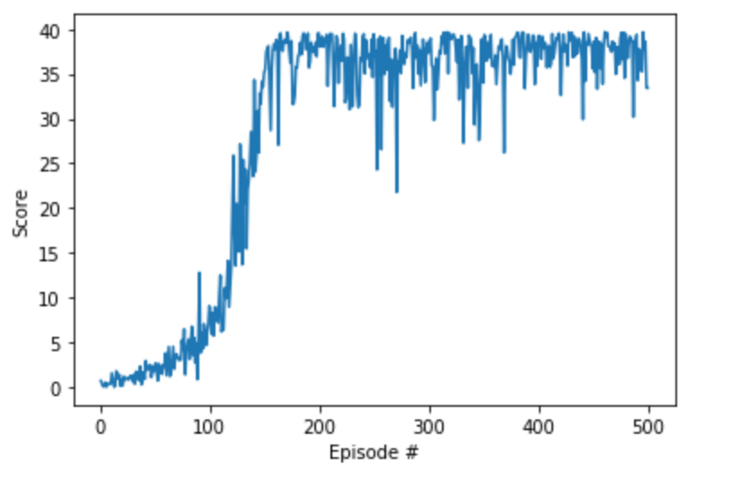

## Project 2 - Continuous Control - 
Train a double-jointed arm can move to target locations. A reward of +0.1 is provided for each step that the agent's hand is in the goal location. Thus, the goal of your agent is to maintain its position at the target location for as many time steps as possible.
## Solution - 
Average score of 30+ rewards across 100 consecutive episodes achieved with 108 episodes.
Environment Used - Reacher.app from Unity.  
Environment Info - The observation space consists of 33 variables corresponding to position, rotation, velocity, and angular velocities of the arm. Each action is a vector with four numbers, corresponding to torque applicable to two joints. Every entry in the action vector should be a number between -1 and 1.

### Learning Algorithm Used - DDPG - 
1) Improvised on DDPG-PENDULUM Session. 
2) Network Architecture And Hyperparamenters - 
    Actor - Number of hidden layers - 2 each with 128 neurons  
    Critic - Number of hidden layers - 2 one with 400 and other with 300 neurons  
    BUFFER_SIZE = 100000            # replay buffer size  
    BATCH_SIZE = 256                # minibatch size  
    GAMMA = 0.9                     # discount factor  
    TAU = 1e-3                      # for soft update of target parameters  
    LR_ACTOR = 0.001                # learning rate of the actor  
    LR_CRITIC = 0.001               # learning rate of the critic  
    WEIGHT_DECAY = 1e-6              # L2 weight decay  

### Plot of Rewards - 

### Improvements - 
With more hyperparameters tuning and some network architecture changes, number of episodes required can be reduced. 
Try solving the task using PPO and compare how both algorithms perform.
