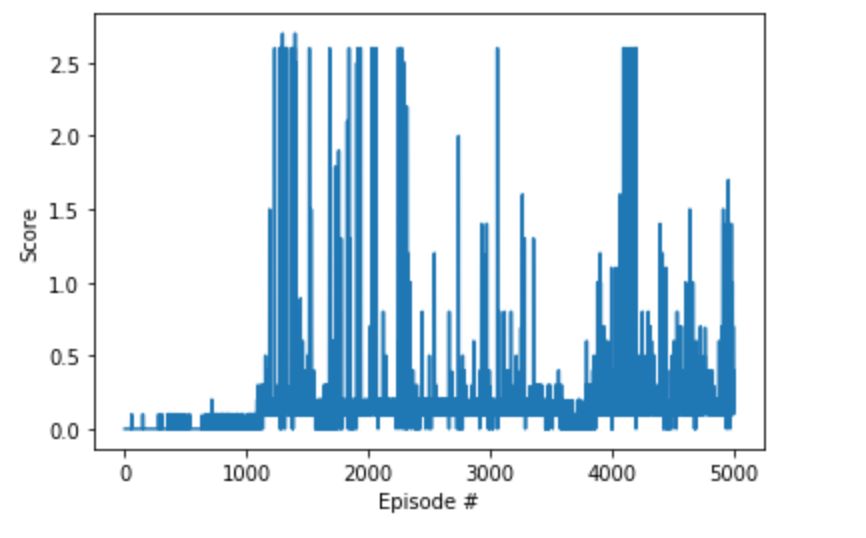

## Project 3 - Collaboration and Competition - Training Tennis playing agents
In this Tennis.app environment, two agents control rackets to bounce a ball over a net. If an agent hits the ball over the net, it receives a reward of +0.1.  If an agent lets a ball hit the ground or hits the ball out of bounds, it receives a reward of -0.01.  Thus, the goal of each agent is to keep the ball in play.
The observation space consists of 8 variables corresponding to the position and velocity of the ball and racket. Each agent receives its own, local observation.  Two continuous actions are available, corresponding to movement toward (or away from) the net, and jumping. 
It is an episodic task and to solve the environment, agents must get an average score of +0.5 (over 100 consecutive episodes, after taking the maximum over both agents). 

## Solution -
To solve this environment with multi agent playing tennis, I have used multi agent ddpg algo using separate actors and critics for each of the agents with shared memory . I have improvised on the code from base DDPG , with one class "Pair" ( referring 2 agents in a pair) in maddpg.py file which handles these 2 agents as a pair. This can easily be adapted for more than 2 agents also.

Average score of 0.5+ across 100 consecutive episodes achieved with 1225 episodes.

### Learning Algorithm Used - MADDPG - 
1) Improvised on DDPG-PENDULUM Session. 
2) Network Architecture And Hyperparamenters -  
    Actor - Number of hidden layers - 2 each with 128 neurons  
    Critic - Number of hidden layers - 2 each with 128 neurons  
    BUFFER_SIZE = 100000            # replay buffer size  
    BATCH_SIZE = 256                # minibatch size  
    GAMMA = 0.9                     # discount factor  
    TAU = 1e-3                      # for soft update of target parameters  
    LR_ACTOR = 0.001                # learning rate of the actor  
    LR_CRITIC = 0.001               # learning rate of the critic  
    WEIGHT_DECAY = 1e-6              # L2 weight decay  

### Plot of Rewards - 

---

### Improvements - 
With more hyperparameters tuning and some network architecture changes, number of episodes required can be reduced to solve it faster 
Trying with shared actors, shared critics etc. 
Trying the same algo on optional task of soccer and see the behavior.

